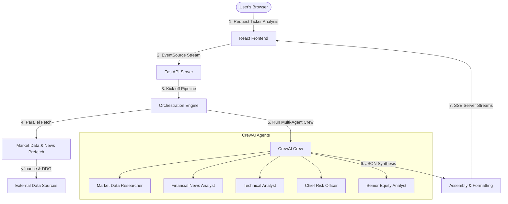

# Stock Intelligence Platform (CrewAI + FastAPI + React)

A production-ready, AI-driven stock intelligence platform utilizing a multi-agent **CrewAI** workflow. The system gathers real-time market data, technical indicators, and financial news, performs deep sentiment and risk analysis, and streams progress in real time to a dashboard.

---

## 🏗️ Architecture Overview

The platform uses a split-deployment architecture. The React/Vite frontend communicates with a FastAPI server that manages the background CrewAI process. Progress updates are streamed to the client using **Server-Sent Events (SSE)**.



---

## 🌟 Key Features

*   **Multi-Agent Collaborative Analysis**:
    *   **Market Data Researcher**: Audits and benchmarks fundamental financial datasets.
    *   **Financial News Analyst**: Performs sentiment analysis and extracts catalysts from recent news.
    *   **Technical Analyst**: Evaluates price charts, trend momentum (RSI, MACD, Bollinger Bands), and identifies support/resistance.
    *   **Chief Risk Officer**: cynicism-driven risk assessor evaluating debt covenants, macro sensitivity, and tail risks.
    *   **Senior Equity Analyst**: Synthesis lead producing the final recommendation (Buy/Hold/Sell) and target horizons.
*   **Real-time Progress Streaming**: Uses FastAPI server-sent events (SSE) to broadcast live updates from the agent workspace directly to the frontend timeline.
*   **Advanced LLM Orchestration**: Dual-LLM gating (fast Groq endpoints for technical/synthesis tasks and reasoning-capable LLMs for deep research).
*   **Premium Glassmorphic UI**: High-fidelity theme-toggle dashboard featuring custom charts (Recharts), dynamic animated statistics, and a interactive Three.js canvas background.

---

## 📁 Repository Directory Structure

```
stock-analyzer/
├── backend/            # FastAPI Python Application
│   ├── main.py         # App entrypoint & SSE endpoints
│   ├── crew.py         # CrewAI orchestrator & task execution
│   ├── agents.py       # Agent roles & LLM configurations
│   ├── tasks.py        # Task descriptions & output schemas
│   ├── prefetch.py     # yfinance & news API prefetch helpers
│   ├── Dockerfile      # Backend Docker configuration
│   └── requirements.txt# Python dependencies
├── app/                # Recommended Frontend (Vite + React + TS)
│   ├── src/            # App code (dashboard, components, hooks)
│   ├── package.json    # React dependencies & scripts
│   └── vercel.json     # Vercel output routing config
└── frontend/           # Alternate Frontend
```

---

## ⚙️ Configuration & Environment Variables

### Backend (`backend/.env`)
Copy the backend environment configuration and specify your API credentials:
```ini
# Base endpoints & models for Deep/Reasoning LLM (Nous Research)
OPENAI_API_KEY=your_nous_api_key_or_openai_key
OPENAI_API_BASE=https://inference-api.nousresearch.com/v1
OPENAI_MODEL_NAME=stepfun/step-3.7-flash:free

# Groq endpoints & models for fast reasoning (Technical/Synthesis)
GROQ_API_KEY=your_groq_api_key
GROQ_API_BASE=https://api.groq.com/openai/v1
GROQ_MODEL_NAME=llama-3.1-8b-instant

# Deployment controls
PORT=8000
FORCE_FAST_LLM=true
AGENT_VERBOSE=false
```

### Frontend (`app/.env`)
Create an `.env` file in the `app` folder to configure the backend API source:
```ini
VITE_API_BASE_URL=http://localhost:8000/api
```

---

## 🚀 Local Development Setup

### 1. Run the Backend
Ensure you have Python 3.11+ installed.
```bash
# Navigate to the backend folder
cd backend

# Create and activate a virtual environment
python -m venv venv
source venv/bin/activate  # On Windows: venv\Scripts\activate

# Install dependencies
pip install -r requirements.txt

# Start the FastAPI server
python main.py
```
The API will be running at [http://localhost:8000](http://localhost:8000).

### 2. Run the Frontend
```bash
# Navigate to the app folder
cd app

# Install dependencies
npm install

# Start the Vite development server
npm run dev
```
The UI dashboard will be available at [http://localhost:3000](http://localhost:3000).

---

## 🌐 Production Deployment (100% Free)

### 1. Backend (Hugging Face Spaces or Render)
*   **Hugging Face Spaces (Docker SDK)** is recommended as it offers 16 GB RAM and doesn't trigger fast sleep timeouts.
    1. Create a Space on Hugging Face, select **Docker** as the SDK, and choose the free CPU basic instance.
    2. Add your `.env` variables under Space Settings -> **Variables and Secrets** (Set `PORT` to `7860`).
    3. Push the `/backend` folder as its own repository to Hugging Face:
       ```bash
       cd backend
       git init
       git add .
       git commit -m "HF Deploy"
       git remote add origin https://huggingface.co/spaces/YOUR_USERNAME/YOUR_SPACE_NAME
       git push -f origin main
       ```

### 2. Frontend (Vercel)
1. Import your main GitHub repository to **Vercel**.
2. Configure project settings:
   - **Root Directory**: `app`
   - **Framework Preset**: `Vite`
   - **Output Directory**: `dist` (automatically routed via the provided `vercel.json` file)
3. Set the environment variable:
   - `VITE_API_BASE_URL` = `https://<YOUR_BACKEND_SUBDOMAIN>.hf.space/api` (or your Render URL)
4. Click **Deploy**.
